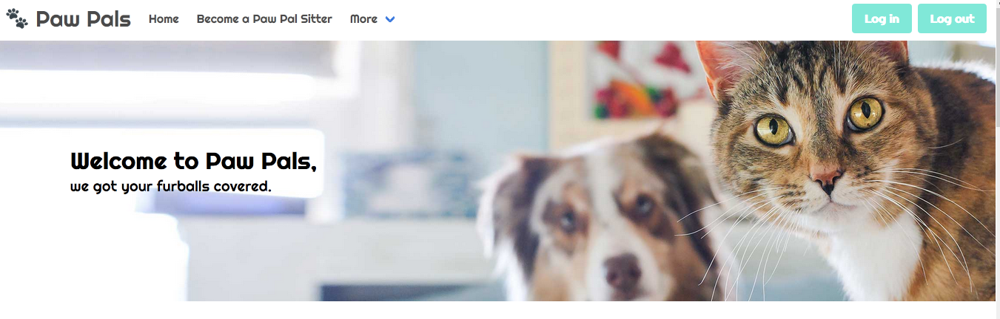
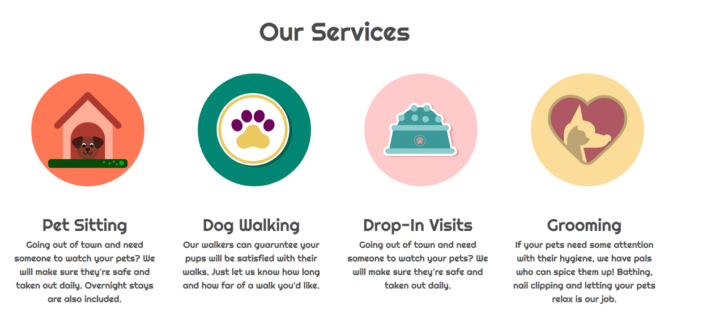
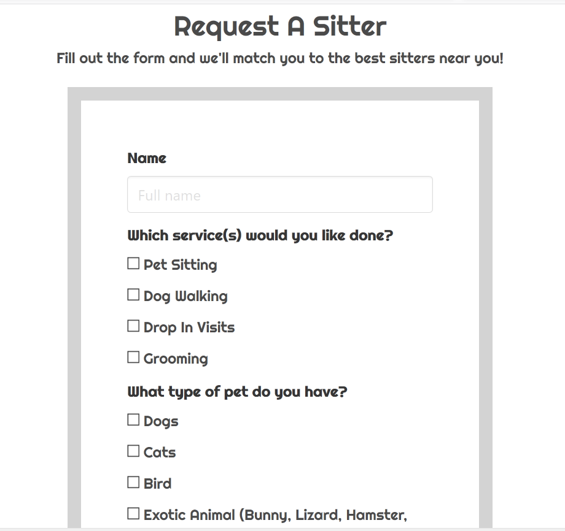
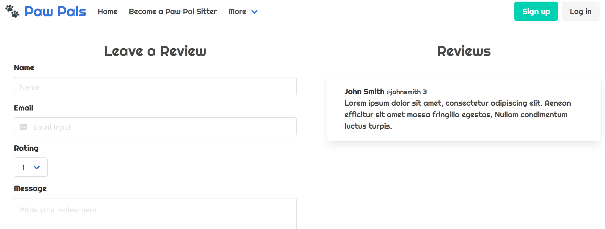
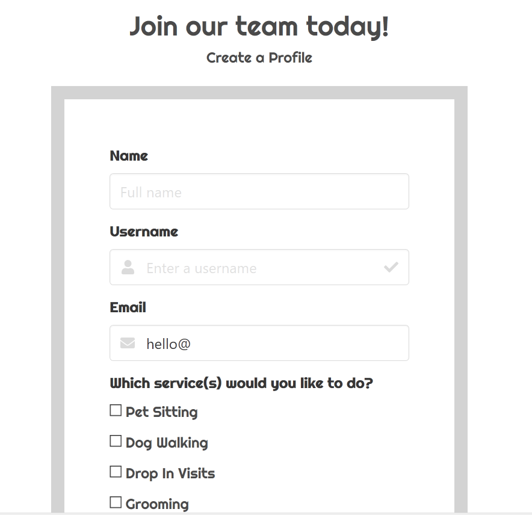

# PawPals Pet Sitting

 [Deployed Heroku Link] (https://warm*dusk*35598.herokuapp.com/)

 [Git Hub Link] (https://github.com/edenhack/project2)   

## Demo Sitter Login

petpaltestsitter@gmail.com
Lic0ric3Whip

## Demo Owner Login

petpaltestowner@gmail.com
L3m0nDr0p*

## Project Summary

> Your dog is like a child so you should be able to trust who is taking care of them. Our site not only helps you find local sitters but also gives the ability to list out services you desire from the sitter with the best reviews in those fields.

## Developers

* Nathan Bright: Auth services and partial database assistance.
  * https://edenhack.github.io/Bootstrap*Portfolio/
  * https://github.com/edenhack
  * https://www.linkedin.com/in/nathan*bright*a8827182/
* Haley Serr: Database
  * https://haleyserr.github.io/Bootstrap*Portfolio/
  * https://github.com/haleyserr
* An Phan: Front End UI
  * https://antphan98.github.io/portfolio/
  * https://github.com/antphan98
  * https://www.linkedin.com/in/antphan/

## Animated Gifs/Pictures of App

## Tech Stack

* Javascript, MySQL, css, html
* Sequelize, Bootstrap, Jquery
* Authentication: Auth0
* CSS: Bulma

## APIs

* Google Maps API

## MVP

* Front End Ui
* User Login system
* Database with reviews and available sitters

## Stretch Goals

* Local Pet News Page
* Rating Matrix/Stats
* Automated alerts
* Increased Scheduling Ability
* Integrate Google API to locate sitter
* Use GPS to track walks on a Map
 

## Future Development

* Pet Lost/Found
* Use DB to create a "doghouse" of all an Owners Pets

## Credits/Resources

* Bulma
